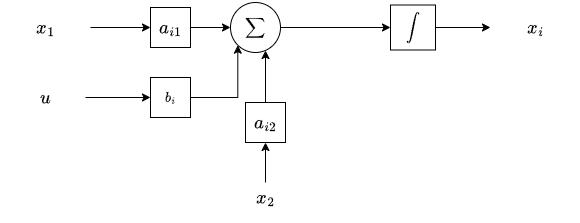
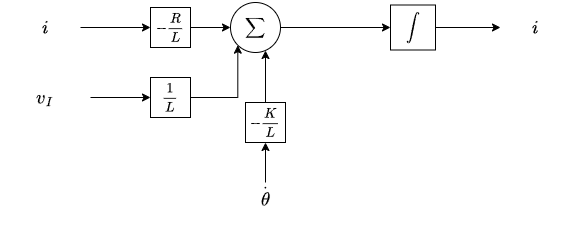
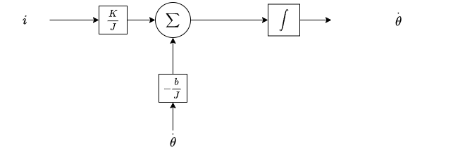
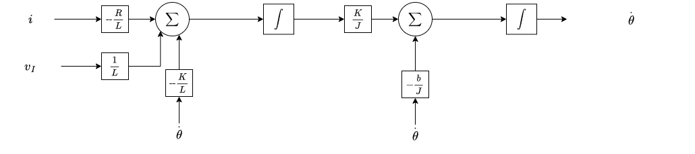
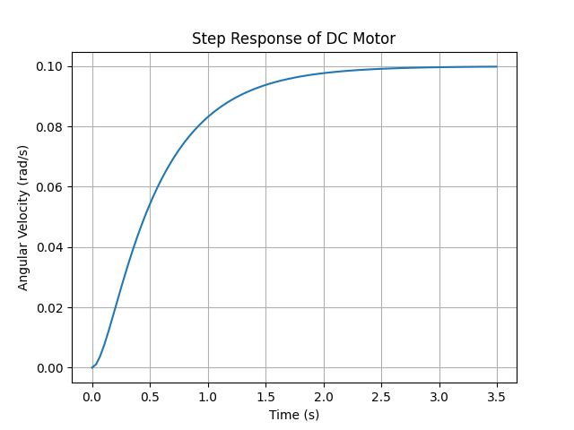
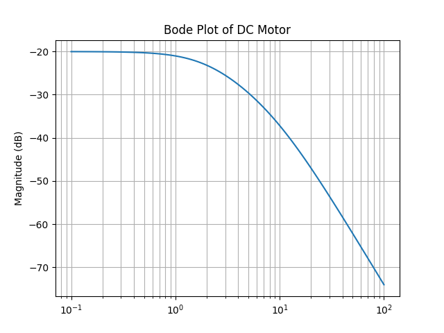
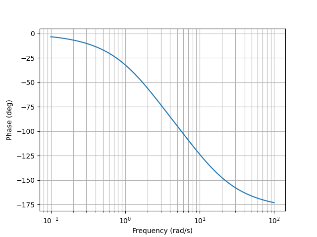

# Modeling CT Systems
We will analyze a CT system in this project. The CT system that we're analyzing is a model of a DC motor circuit, as shown below:

Figure 1. DC Motor Circuit

## State-Space Description of the Model
Here we will create a state-space description of Figure (1) using $v_I$ as the input and the angular velocity $\overset{.}{\theta}$ as the output.

We will use these two equations given to us:

(1)

$$ v_I = Ri + L\overset{.}{i} + K\overset{.}{\theta}$$

(2)

$$ J\overset{..}{\theta} = Ki - b\overset{.}{\theta} $$

We will assign:

$$
x_1 = i \\
x_2 = \overset{.}{\theta}  \\
y = \overset{.}{\theta} = x_2 \\
v_I = u
$$

We will then solve for $\overset{.}{x_1}$ and $\overset{.}{x_2}$ using both equation (1) and (2). 

First we solve for $\overset{.}{x_1}$ using equation (1):

$$
u = Rx_1 + L\overset{.}{x_1} + Kx_2 \\
u - L\overset{.}{x_1} = Rx_1 + Kx_2 \\
-L\overset{.}{x_1} = Rx_1 + Kx_2 - u \\
\overset{.}{x_1} = -\frac{R}{L}x_1 - \frac{K}{L}x_2 + \frac{1}{L}u
$$

Next we will solve for $\overset{.}{x_2}$ using equation (2):

$$
J\overset{.}{x_2} = Kx_1 - bx_2 \\
\text{} \\
\overset{.}{x_2} = \frac{K}{J}x_1 - \frac{b}{J}x_2
$$

The solutions for $\overset{.}{x_1}$ and $\overset{.}{x_2}$ are:

(3)

$$ \overset{.}{x_1} = \frac{1}{L}u - \frac{R}{L}x_1 - \frac{K}{L}x_2 $$

(4)

$$ \overset{.}{x_2} = \frac{K}{J}x_1 - \frac{b}{J}x_2 $$

From this, we can construct the state-space description:

(5)

$$
\overset{.}{x} =
\begin{pmatrix}
-\frac{R}{L} & -\frac{K}{L} \\
\frac{K}{J} & -\frac{b}{J}
\end{pmatrix}
x +
\begin{pmatrix}
\frac{1}{L} \\
0
\end{pmatrix}
u
$$

(6)

$$ y =
\begin{pmatrix}
0 & 1
\end{pmatrix}
x
$$

## Constructing the Block Diagram
Here we will construct the block diagram using equations (3) and (4).

We will start by resubsituting back in our original representations of the variables:

$$
\overset{.}{i} = -\frac{R}{L}i - \frac{K}{L}\overset{.}{\theta} + \frac{1}{L}v_I
$$

 

$$ 
\overset{..}{\theta} = \frac{K}{J}i - \frac{b}{J}\overset{.}{\theta} 
$$

State-space descriptions always follow a pattern when constructing the block diagram. Using the basic formula for state-space descriptions $\overset{.}{x_i} = a_{i1}x_1 + a_{i2}x_2 + b_iu$, we can use it's related block diagram pattern:

We start by constructing the block diagram for $x_1$:

Then we construct the block diagram for $x_2$:

Then we combine both block diagrams by connecting the output of $x_1$ to the input of $x_2$:

Figure 2. Block Diagram for a DC Motor Circuit

## Transfer Function
Here we will solve for the transfer function which is $\frac{\Omega(s)}{V_I(s)}$.

First we need to get the Laplace transformation of $v_I$ and $i$ from equations (1) and (2):

$$ 
V_I(s) = RI(s) + LsI(s) + K\Omega(s) \\
V_I(s) = I(s)(R + Ls) + K\Omega(s)
$$  

 

$$
sJ\Omega(s) = KI(s) - b\Omega(s) \\
KI(s) = b\Omega(s) + sJ\Omega(s) \\
KI(s) = \Omega(s)(b + sJ) \\
I(s) = \Omega(s)\frac{b + sJ}{K}
$$

The Laplace transformations are:

(7)

$$ V_I(s) = I(s)(R + Ls) + K\Omega(s) $$

(8)

$$ I(s) = \Omega(s)\frac{b + sJ}{K} $$

Now let's subsitute equation (8) into equation (7):

$$
V_I(s) = (\Omega(s)\frac{b + sJ}{K})(R + Ls) + K\Omega(s) \\
V_I(s) = R\Omega(s)\frac{b + sJ}{K} + Ls\Omega(s)\frac{b + sJ}{K} + K\Omega(s)
$$

We then factor out the $\Omega(s)$ and the numerator of the equation additionally:

$$
V_I(s) = \Omega(s)(\frac{R(b + sJ)}{K} + \frac{Ls(b + sJ)}{K} + K)\\
V_I(s) = \Omega(s)(\frac{(R + Ls)(b + sJ)}{K} + K) 
$$

Using our formula for the transfer function $\frac{\Omega(s)}{V_I(s)}$, we can easily see:

$$
\frac{\Omega(s)}{V_I(s)} = \frac{\Omega(s)}{\Omega(s)(\frac{(R + Ls)(b + sJ)}{K} + K)} = \frac{1}{\frac{(R + Ls)(b + sJ)}{K} + K}
$$

We can further simplify the transfer function like so:

$$
H(s) = \frac{1}{\frac{(R + Ls)(b + sJ)}{K} + K} * \frac{K}{K} \\
H(s) = \frac{K}{(R + Ls)(b + sJ) + K^2} \\
H(s) = \frac{K}{Rb + RsJ + Lsb + LJs^2 + K^2} \\
H(s) = \frac{K}{R(b + sJ) + L(sb + Js^2) + K^2} \\
$$

So our transfer function is:

(9)

$$ H(s) = \frac{K}{R(b + sJ) + L(sb + Js^2) + K^2} \\ $$

## Step and Frequency Response of the CT System
Here we will analyze the frequency and step response of the DC motor CT system.

### Step Response

We will first analyze the step response on the transient plane. According to `main.py`, our estimated setting time is as followed:

`Estimated Settling Time: 2.0479443196268896 seconds`

Followed is the plot of the step response:

### Frequency Response

Next we will analyze the frequency response of the system. Looking at the plots below, we can see that our system has a low-pass response and cannot respond to high-frequency signals. The bandwidth of the system is approximately 10 rad/s, which is equivalent to 1.6 Hz, due to being a DC motor circuit. Therefore, this DC motor CT system will not respond to a normal PWM signal.

Followed is the Bode plot for the magnitude on the frequency spectra as well as the phase plot of the system:

